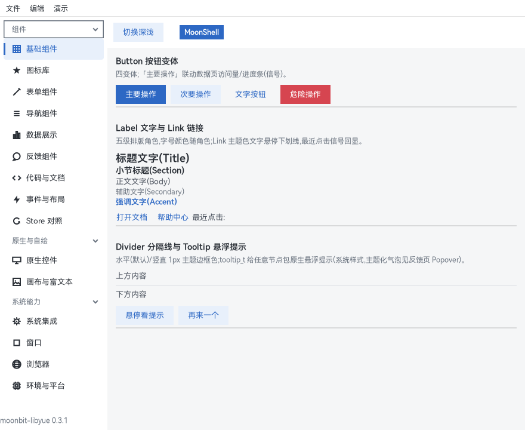
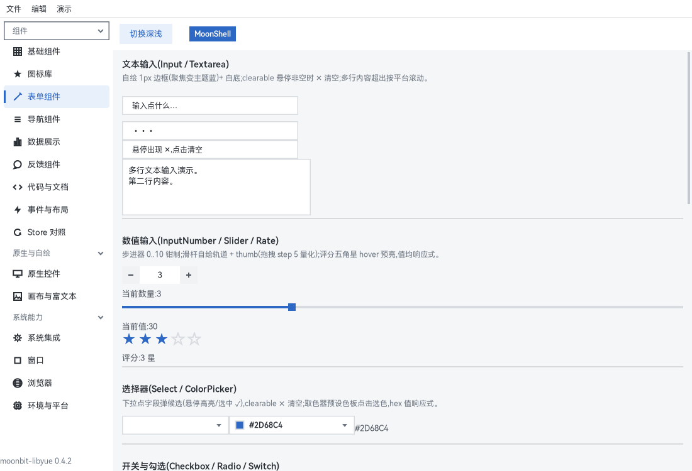
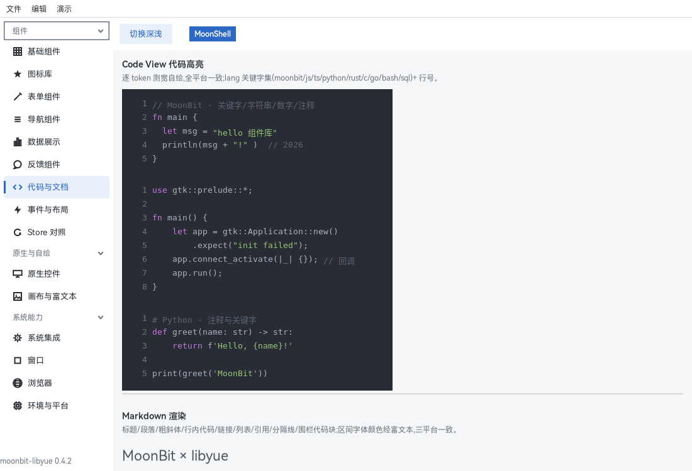
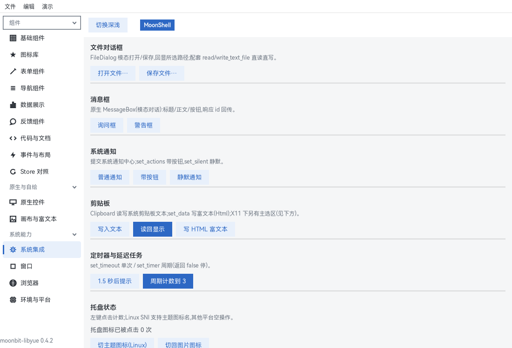
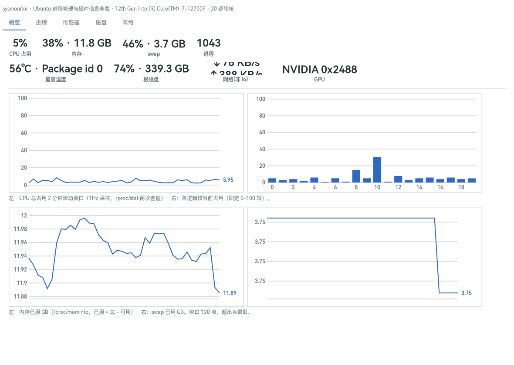
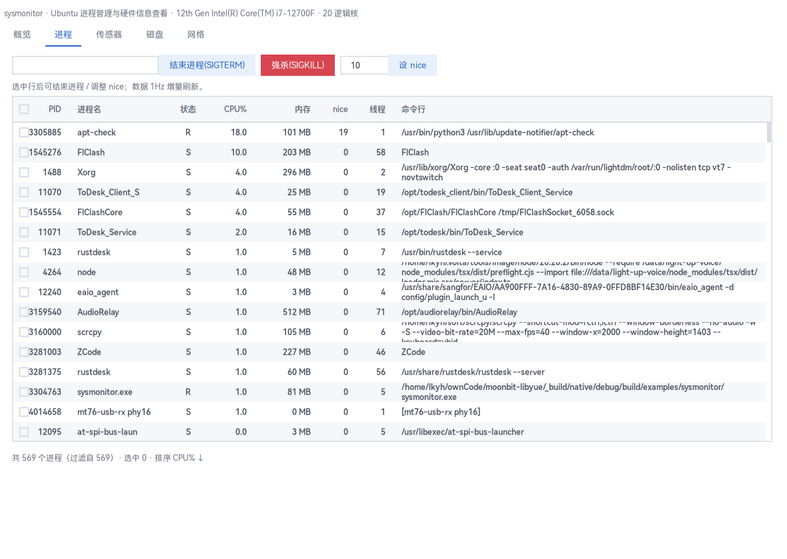
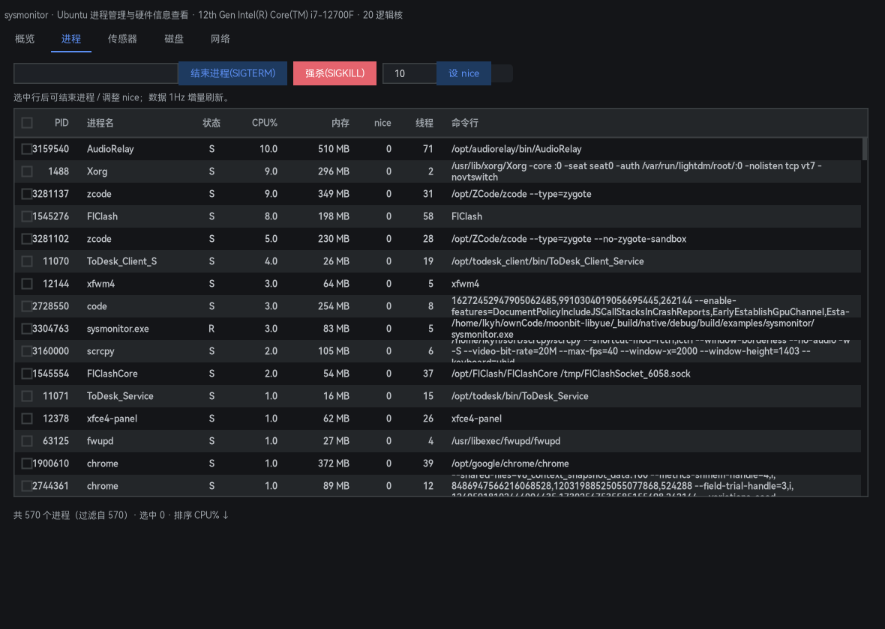

# Documentation Index

## Introduction

This directory holds the usage documentation for moonbit-libyue. The component API has two usage styles, semantically identical: the **classic per-setter approach** (`X::new()` + `set_xxx()`), or the **props-style one-shot approach** (`X::make(...)`, just a bundle of setters); all types are referenced via `@yue`, and the widget API quick reference (parameters / method tables) is in [components.md](components.md).

Never touched MoonBit? Start from the [five-minute tutorial](tutorial.md) — learning MoonBit, installing dependencies, and building your first desktop app.

## Demo

Four examples, from shallow to deep:

```sh
moon run examples/hello         # minimal window with the original widgets
moon run examples/hello-themed  # minimal example of the themed component library (theme_apply + button_t/input_t/label_t)
moon run examples/showcase      # full-capability demo board: 15 pages, three grouped sidebars, component library + system capabilities
moon run examples/sysmonitor    # flagship app: Ubuntu process manager & hardware monitor (1000-row process table + live curves)
```

The showcase covers: Basic / Icons / Form / Navigation / Data Display / Charts / Feedback / Code & Docs / Events & Layout / Store comparison + Native widgets / Canvas & rich text + System Integration / Window / Browser / Environment & Platform, with a collapsible grouped side menu and the package version pinned at the bottom (kept in sync with moon.mod). Each page's source is its own file (`examples/showcase/pages_*.mbt`) — the best copy-paste material library; screenshots of the component library:










### sysmonitor: process manager & hardware monitor

The library's flagship app for expressiveness + performance: the data layer reads /proc and /sys in pure MoonBit (two-sample CPU diff, memory, a 1000-row process list, hwmon temperatures, disk IO and capacity, PCI GPUs, NIC rates), with the only syscalls going through the app's own native stub. Five tabbed pages (Overview / Processes / Sensors / Disks / Network), one 1Hz timer driving all sampling; curves and value cards repaint the canvas only, never rebuilding the view tree; light/dark follows the system.

Process page: a virtual table at the 1000-row scale with search filtering, six sortable columns, and selection-driven kill (SIGTERM, falling back to SIGKILL) / renice, with errno mapped to Chinese notices. Measured: full sampling of 1053 processes in 14.94ms/pass, steady-state 1Hz CPU 2-3% (figures in [adaptation.md](adaptation.md)).







## Routing

| Document | Content |
|---|---|
| [tutorial.md](tutorial.md) | Five-minute tutorial (for MoonBit newcomers): from `moon new` to a running window, avoiding the three newcomer pitfalls one by one; includes links to the official MoonBit tutorial & Tour |
| [declarative.md](declarative.md) | Declarative UI: `Node`/`mount` render tree + `Store`/`Signal` reactive bindings (signals: computed with automatic dependency tracking + batch) |
| [layout.md](layout.md) | Layout style key quick reference: all Yoga flexbox style keys (enum / numeric / edge / special) + common-combination examples |
| [components-ui.md](components-ui.md) | Themed component library quick reference: Element-Plus-style themed components (buttons/input/selection/forms/navigation/layout/data display/charts/icons/feedback/overlays), per-API signatures + parameter tables + examples |
| [components.md](components.md) | Widget API quick reference: both classic setter and `X::make` props styles, including upstream pitfalls |
| [adaptation.md](adaptation.md) | Platform adaptation notes: field-tested pitfalls per platform, root causes, and verification conclusions (continuously updated) |
| [tray.md](tray.md) | Linux tray solution: SNI protocol stack design, architecture, backend fallback, desktop compatibility |
| [autostart.md](autostart.md) | Cross-platform autostart: XDG .desktop on Linux / HKCU Run key on Windows, unified is_enabled / enable / disable |
| [relink.md](relink.md) | Forcing a relink after native layer (shim/vendor) changes: detection and handling |

For the project overview and quick-start entry points, see the repository root [README.md](../README.md).

[中文版文档索引](zh/README.md)
