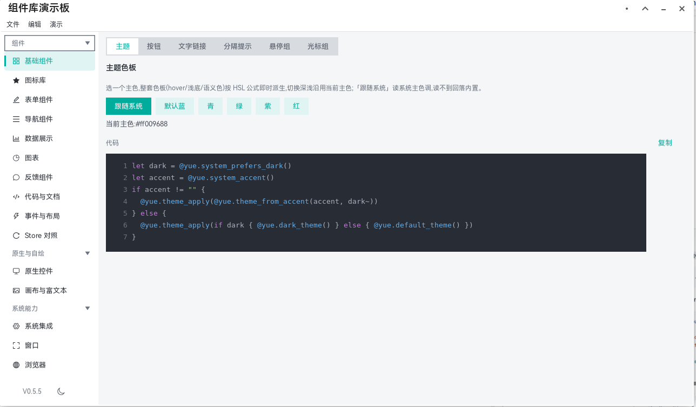
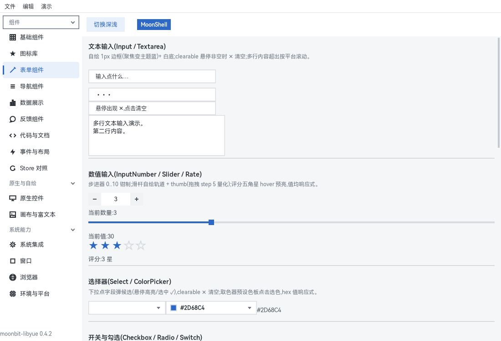
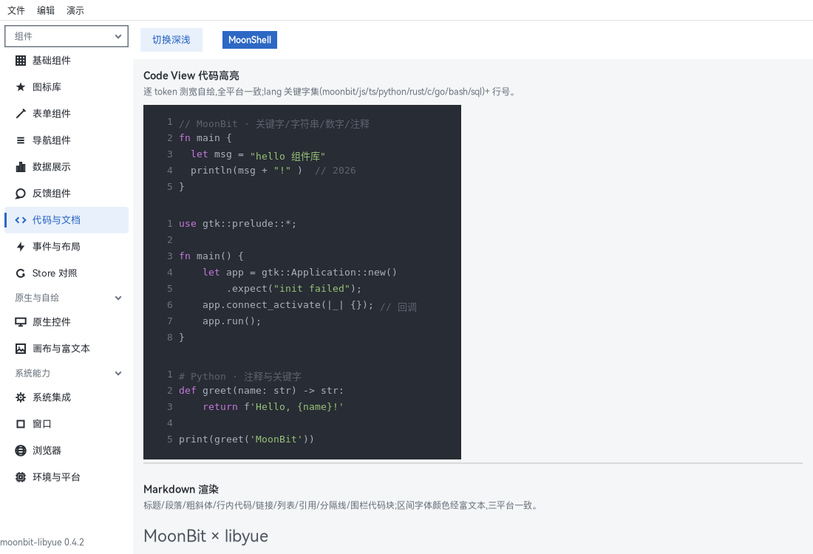
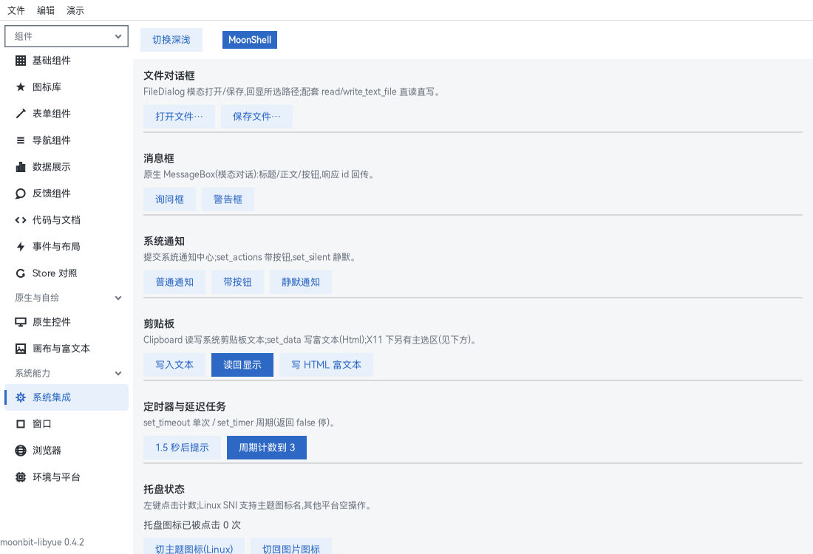
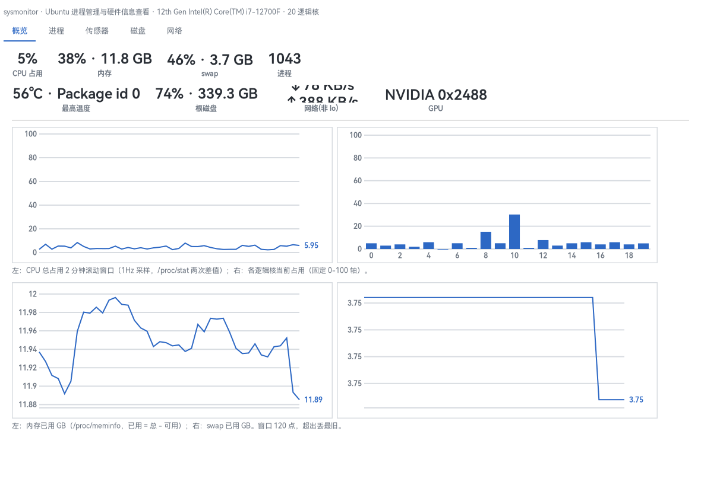
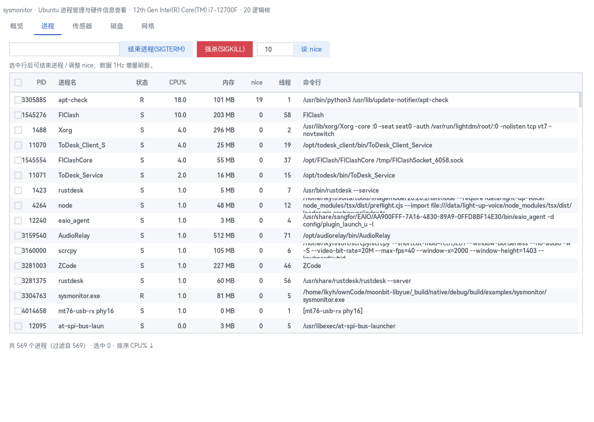
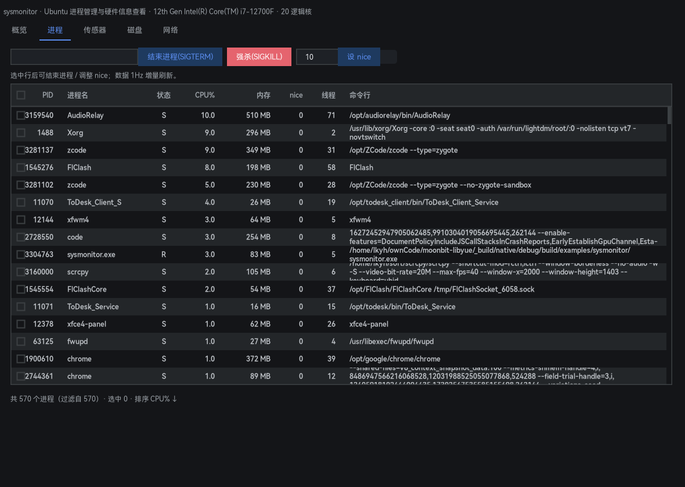

# 文档索引

## 引入

本目录是 moonbit-libyue 的使用文档。组件 API 有两种写法、语义完全一致：**逐个 setter 的经典写法**（`X::new()` + `set_xxx()`），或 **props 风格一步到位**（`X::make(...)`，只是 setter 的打包）；所有类型经 `@yue` 引用，控件 API 速查（入参 / 方法表）见 [components.md](components.md)。

完全没接触过 MoonBit？从[五分钟上手教程](tutorial.md)开始——学 MoonBit、装依赖、建出第一个桌面应用。

## 演示

四个示例，由浅入深：

```sh
moon run examples/hello         # 原版控件最小窗口
moon run examples/hello-themed  # 主题组件库最小示例（theme_apply + button_t/input_t/label_t）
moon run examples/showcase      # 全功能演示板：15 页三组侧栏，组件库 + 系统能力全集
moon run examples/sysmonitor    # 旗舰应用：Ubuntu 进程管理与硬件信息查看（千行进程表 + 实时曲线）
moon run examples/systemprobe   # 系统能力 + 扩展图表演示板（音量/亮度/浏览器历史/VS Code/应用查找 + 雷达/热力/K 线/漏斗/箱线/桑基）
```

showcase 覆盖：基础 / 图标库 / 表单 / 导航 / 数据展示 / 图表 / 反馈 / 代码与文档 / 事件与布局 / Store 对照 + 原生控件 / 画布与富文本 + 系统集成 / 窗口 / 浏览器；左侧分组可折叠菜单，底栏版本号与 moon.mod 同步。每页源码独立成文件（`examples/showcase/pages/*.mbt`），是最好的复制粘贴素材库；组件库各组件的截图：










### sysmonitor：进程管理与硬件信息查看

库「表现力 + 性能」的旗舰应用：数据层纯 MoonBit 读 /proc、/sys（CPU 两次差值、内存、千行进程、hwmon 温度、磁盘 IO 与容量、PCI 显卡、网卡速率），唯一的系统调用经应用自有 native-stub；五页 tabs（概览 / 进程 / 传感器 / 磁盘 / 网络），1Hz 单定时器驱动全部采样，曲线与数值卡只重绘画布不重建视图树，主题深浅跟随系统。

进程页：虚拟表格千行级，搜索过滤、六列排序、选中 kill（SIGTERM 失败转 SIGKILL）/ renice，errno 语义化为中文提示；实测 1053 进程全量采样 14.94ms/次、稳态 1Hz CPU 2-3%（数据见 [adaptation.md](adaptation.md)）。







## 分流

| 文档 | 内容 |
|---|---|
| [tutorial.md](tutorial.md) | 五分钟上手教程(面向 MoonBit 新手):从 `moon new` 到窗口跑起来,三个新手坑逐一避开;附官方 MoonBit 教程与 Tour 链接 |
| [declarative.md](declarative.md) | 声明式 UI:`Node`/`mount` 渲染树 + `Store`/`Signal` 响应式绑定(信号 computed 自动依赖收集 + batch) |
| [layout.md](layout.md) | 布局样式键速查:Yoga flexbox 全部样式键(枚举/数值/边缘/特殊)+ 常用组合示例 |
| [components-ui.md](components-ui.md) | 组件库速查:Element Plus 风格主题化组件(按钮/输入/选择/表单/导航/布局/数据展示/图表/图标/反馈/浮层),逐 API 签名 + 参数表 + 示例;图表含折线/柱状/环形/仪表/散点与扩展图表(雷达/热力/K 线/漏斗/箱线/桑基),以及第二批层级/地理/力导向/时间流图表(树图/矩形树图/旭日图/地图与飞线/力导向关系图/平行坐标/主题河流/涟漪散点/象形柱)与横切交互层(hover 浮层与命中、可点击图例、DataZoom 缩放平移、阈值线与高亮域、色带映射、导出) |
| [components.md](components.md) | 组件 API 速查:经典 setter 与 `X::make` props 两种写法,含上游坑 |
| [adaptation.md](adaptation.md) | 平台适配经验:各平台实测坑、根因与验证结论(持续更新) |
| [tray.md](tray.md) | Linux 托盘方案:SNI 协议栈设计、架构、后端降级、桌面兼容性 |
| [autostart.md](autostart.md) | 开机自启动:Linux 写 XDG .desktop、Windows 写 HKCU Run 键,is_enabled / enable / disable 统一语义 |
| [system-capabilities.md](system-capabilities.md) | 系统能力:屏幕亮度 / 键盘背光 / 系统音量(wpctl 优先 pactl 回退;输出设备枚举与逐应用播放流)/ 媒体控制(MPRIS,playerctl 回退)/ 夜间色温 / 壁纸 / 显示器配置 / 系统窗口管理 / 剪贴板监听 / 磁盘卷(udisks2 优先 lsblk 回退)/ 电源与登录会话 / 电源计划 / 系统信息 / 时区与本地语言 / 蓝牙 / 传感器 / 打印机 / 进程内环境变量与目录枚举 / 最近文件 / 浏览器书签与 Firefox 历史 / 应用查找 / VS Code 本地历史与最近工作区 / 浏览器历史与下载记录,统一 Result 语义;含子进程执行(procrun)与通用 D-Bus 调用层(traybus)两块共享基建 |
| [plan-system-integration.md](plan-system-integration.md) | 系统集成扩容总体实施计划:P1-P12 与收口项 P14 的批次划分、验收门、共享基建决策与风险(定稿) |
| [relink.md](relink.md) | 原生层(shim/vendor)变更后强制重链:判别与处理 |

项目总览与快速开始入口见仓库根 [README_ZH.md](../../README_ZH.md)。
